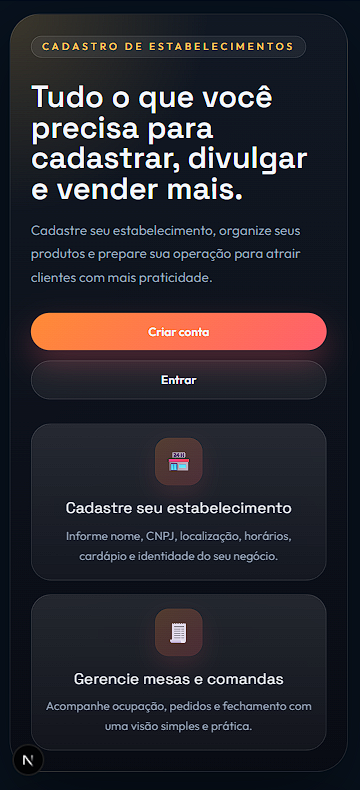
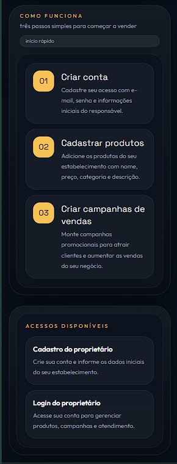
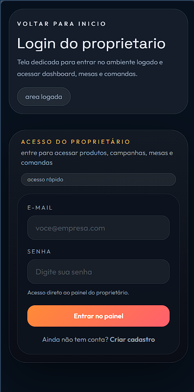
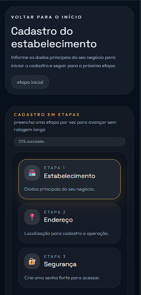
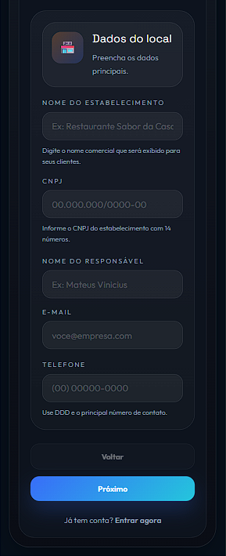
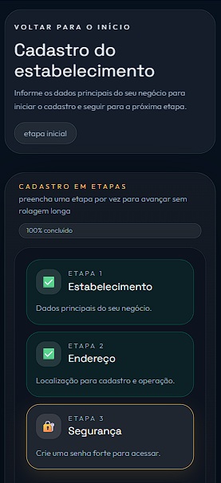

## 🚀 Sistema Next.js para Gestão de Comandas 2026.


Um projeto moderno e premium focado em otimizar e gerenciar o atendimento, mesas e comandas de estabelecimentos comerciais, desenvolvido com uma arquitetura responsiva e focado no usuário (Mobile-First).

---

## 🛠️ Tecnologias Utilizadas

* **Framework Base:** Next.js 16 (App Router)
* **Linguagem:** TypeScript
* **Estilização:** Tailwind CSS (com foco em design responsivo e glassmorphism)

---

## 📸 Preview do Sistema Online

Confira algumas telas do painel gerencial:

| 📋 Controle de Comandas | 📊 Painel Principal (Resumo de Caixa) | 🍽️ Vitrine / Onboarding |
|:---:|:---:|:---:|
|  |
|  |
|  |

|  |
|  |
|  |

---

## ⚙️ Como Rodar o Projeto (Localmente)

Siga os passos abaixo para levantar a aplicação em sua máquina:

1. **Instale as dependências do projeto:**
   ```bash
   npm install
   ```

2. **Inicie o servidor de desenvolvimento:**
   ```bash
   npm run dev
   ```

3. **Acesse no navegador:**  
   Abra [http://localhost:3000](http://localhost:3000) e veja a mágica acontecer! ✨

---

## 👨‍💻 Funcionalidades Atuais
- ✅ Gestão Visual de Mesas.
- ✅ Gestão de Comandas (com Gerador Dinâmico de QR Code PIX).
- ✅ Onboarding Guiado e Multi-steps para cadastro de cardápio.
- ✅ Responsividade 100% Mobile (UI adaptativa).
